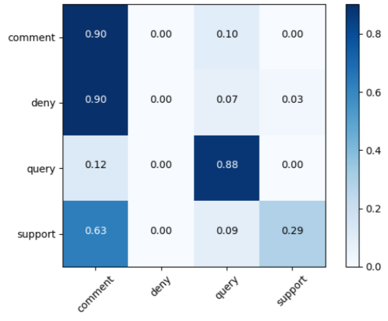
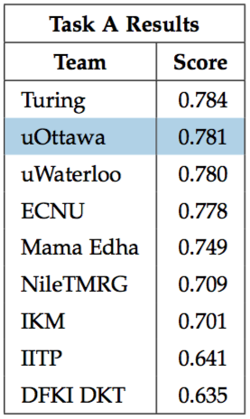
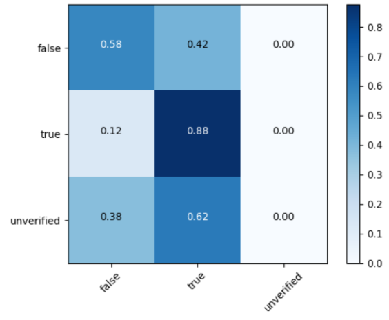
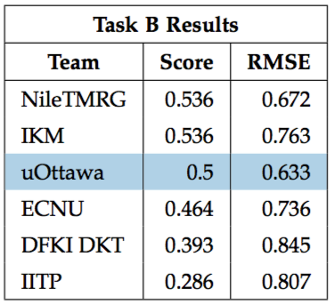

# CSI4900

[RumourEval](http://alt.qcri.org/semeval2017/task8/): Determining rumour veracity and support for rumours

Tong Liu and Joseph Roque

## Abstract

Taken from our CSI 4900 final report for the University of Ottawa

> This paper outlines our attempt at creating a classifier for SemEval 2017, task 8: RumourEval. Social media has become a primary news source for many individuals, but it is becoming increasingly difficult to identify fake news stories. This task is divided into two subtasks, which ask for classifiers that can determine the context of numerous tweets in a thread, and then predict the veracity of a tweet as true, false, or unverified, at the time of posting. Our approach for subtask A uses a set of various numeric and boolean features to train two SVM classifiers, one for one-class learning, and one general classifier. Our approach for subtask B was using a similar set of features, with the addition of our results from subtask A, to train an SVM classifier. These approaches achieved a 78.1\% accuracy and 50\% accuracy, the second and third highest results for subtask A and B, respectively.

## Results

### Task A

Below you can find the final confusion matrix of our classifier for task A, which was meant to identify tweets which were comments about, denials of, supportive of, or querying of the source tweet. The labels on the left are true labels, and those on the bottom are what our classifier assigned.

These are the final results for task A in the competition, with our personal results added for comparison.

### Task B

Below you can find the final confusion matrix of our classifier for task B, meant to identify tweets which were either false, true, or unverified. The labels on the left are true labels, and those on the bottom are what our classifier assigned.

These are the final results for task B in the competition, with our personal results added for comparison.

## How to Run

### Dependencies

- Python3 (we recommend install with [pyenv](https://github.com/pyenv/pyenv))
- python-magic ([see dependencies](https://github.com/ahupp/python-magic#dependencies))
    - For Mac, `brew install libmagic`

### Running the code

`python3 -m rumoureval [--verbose] [--test] [--osorted] [--disable-cache] [--plot] [--trump]`

- `--verbose` to get verbose output
- `--test` to train on training data, then evaluate on test data. Without, model is tested on validation data
- `--osorted` to output tweets sorted into their classes for task A and B
- `--disable-cache` to force the task A classifier to retrain on training data. Used to speed up iterations on classifier in task B
- `--plot` to plot the confusion matrices of task A and B
- `--trump` to test classification of Trump tweets picked and labelled by ourselves

## Contributing

Ensure all code passes pylint and pycodestyle tests, with the following invocations:

- `pylint rumoureval setup.py`
- `pycodestyle --max-line-length=100 rumoureval setup.py`
